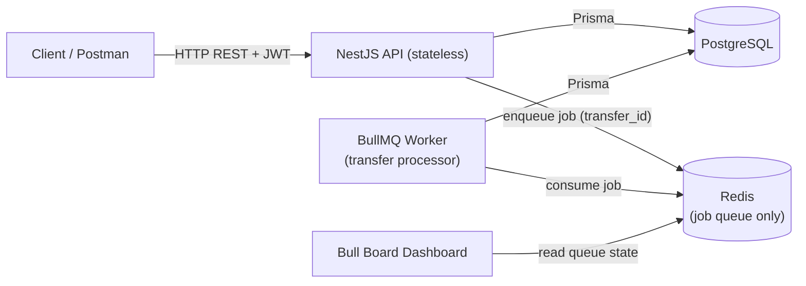
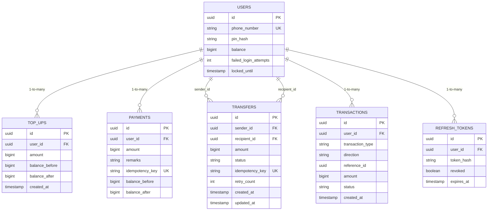
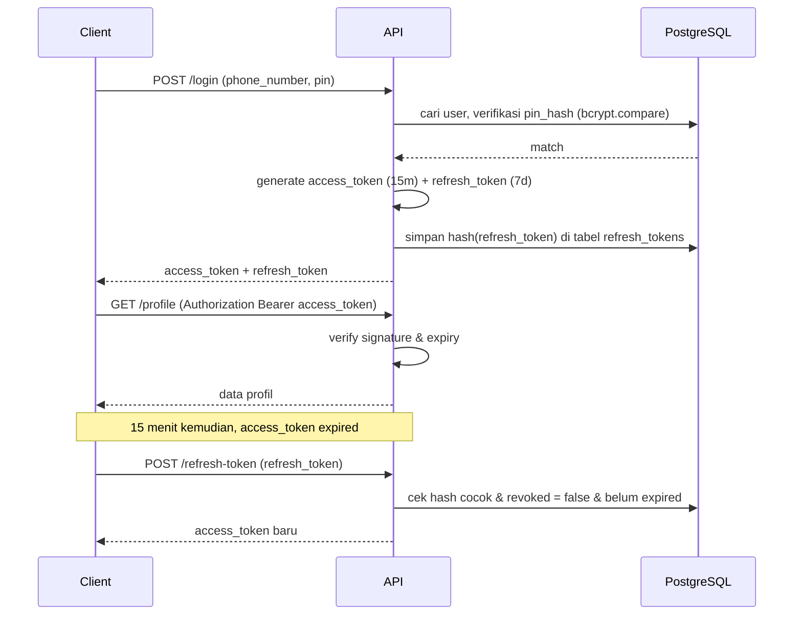
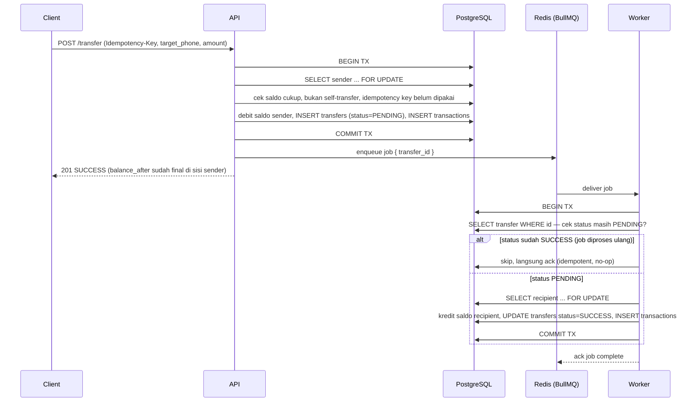
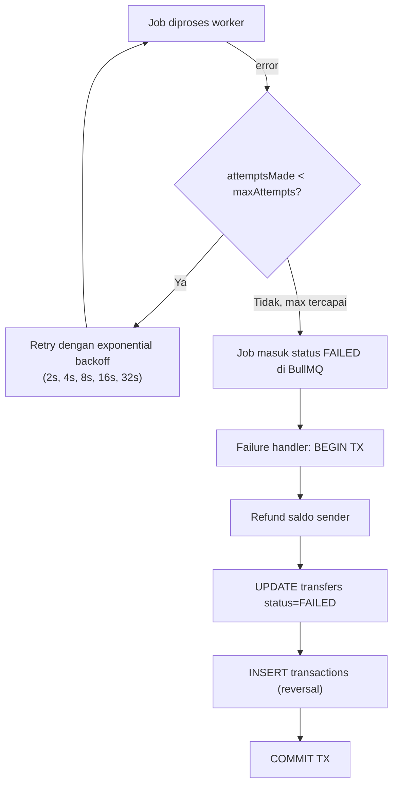

# System / Technical Design Document
## Digital Wallet API

**Versi:** 1.0
**Referensi:** PRD.md, SRS.md
**Fokus dokumen ini:** bagaimana sistem dibangun — arsitektur, ERD, flow, concurrency, dan setup Redis/BullMQ dari nol.

---

## 1. High-Level Architecture



**Kenapa API dan Worker dipisah secara logis** (walau di MVP ini jalan di satu process — lihat Section 6.3): request HTTP biasa (register, login, top up, cek profil) butuh respons cepat dan tidak boleh ketunda oleh backlog job transfer. Kalau logic keduanya campur tanpa batas jelas, satu lonjakan volume transfer bisa bikin endpoint lain ikut lambat. Memisahkan secara *modul* (bukan wajib secara *process* di tahap ini) menjaga opsi untuk split jadi container terpisah nanti tanpa refactor besar.

**Redis di desain ini cuma dipakai untuk satu hal: backing store BullMQ.** Tidak dipakai untuk session, cache, atau rate-limiting — supaya scope-nya kecil dan gampang dipahami sebagai orang yang baru pertama kali pakai Redis.

---

## 2. Database ERD



`TRANSACTIONS` adalah ledger terpadu (keputusan SRS 7.2) — ditulis di transaksi DB yang sama saat top up/payment/transfer terjadi, jadi `/transactions` tinggal query satu tabel dengan index `(user_id, created_at)`, bukan `UNION` tiga tabel tiap request.

---

## 3. API Architecture — Struktur Modul

```
src/
├── auth/                    # register, login, refresh-token, JWT guard
├── users/                   # GET/PUT /profile
├── wallet/
│   ├── topup/
│   ├── payment/
│   └── transfer/
│       ├── transfer.controller.ts
│       ├── transfer.service.ts       # producer — enqueue job
│       └── transfer.processor.ts     # consumer — proses job
├── transactions/             # GET /transactions
├── prisma/                   # PrismaService, satu koneksi terpusat
├── common/
│   ├── filters/               # exception filter → error envelope SRS 1.3
│   └── interceptors/          # response envelope untuk success
├── main.ts                   # bootstrap API
└── worker.ts                 # opsional, lihat Section 6.3
```

Layer per module: **Controller** (terima request, validasi via DTO) → **Service** (business logic) → **Prisma** (akses data). Guard JWT dipasang di level controller yang butuh auth, bukan diulang manual tiap route.

---

## 4. JWT Flow



Refresh token disimpan sebagai **hash**, bukan plaintext — supaya kalau DB bocor, token tidak langsung bisa dipakai. `revoked` flag memungkinkan logout paksa (invalidate refresh token) tanpa perlu blacklist JWT access token yang stateless.

---

## 5. Transfer Flow (Reserve-and-Async)

Ini bagian paling kritis — kombinasi API request (sinkron) dan worker (async).



**Kenapa desain ini otomatis menghindari deadlock klasik "lock dua akun":** karena debit sender dan kredit recipient terjadi di **transaksi DB yang berbeda** (satu di request API, satu di worker) — bukan satu transaksi yang lock dua row sekaligus. Pattern lock-dua-akun-dalam-urutan-konsisten yang biasa dibahas di buku sistem transfer tidak relevan di sini justru karena desain async ini, bukan karena diabaikan.

**Kegagalan job (BullMQ retry):**


---

## 6. Redis & BullMQ — Setup dari Nol

### 6.1 Docker Compose

```yaml
# docker-compose.yml
services:
  postgres:
    image: postgres:16-alpine
    environment:
      POSTGRES_USER: wallet
      POSTGRES_PASSWORD: wallet
      POSTGRES_DB: wallet_db
    ports: ["5432:5432"]
    volumes: ["pgdata:/var/lib/postgresql/data"]

  redis:
    image: redis:7-alpine
    command: redis-server --appendonly yes
    ports: ["6379:6379"]
    volumes: ["redisdata:/data"]

volumes:
  pgdata:
  redisdata:
```

Dua hal yang **wajib** ada, bukan opsional:
- `command: redis-server --appendonly yes` — mengaktifkan **AOF (Append Only File) persistence**. Tanpa ini, Redis murni in-memory: kalau container restart, semua job yang masih antre **hilang**. Untuk fitur yang megang saldo, ini bukan pilihan.
- `volumes: ["redisdata:/data"]` — AOF file butuh disimpan ke disk yang persisten, bukan cuma di dalam container yang bisa hilang saat container dibuang.

Jalankan: `docker compose up -d`. Cek Redis hidup: `docker exec -it <container> redis-cli ping` → harus balas `PONG`.

### 6.2 Instalasi & Registrasi di NestJS

```bash
npm install bullmq @nestjs/bullmq ioredis
```

```typescript
// app.module.ts
import { BullModule } from '@nestjs/bullmq';

@Module({
  imports: [
    BullModule.forRoot({
      connection: {
        host: process.env.REDIS_HOST,
        port: Number(process.env.REDIS_PORT),
      },
    }),
    // ...module lain
  ],
})
export class AppModule {}
```

```typescript
// wallet/transfer/transfer.module.ts
import { BullModule } from '@nestjs/bullmq';

@Module({
  imports: [
    BullModule.registerQueue({ name: 'transfer-queue' }),
  ],
  providers: [TransferService, TransferProcessor],
  controllers: [TransferController],
})
export class TransferModule {}
```

### 6.3 Producer — Enqueue Job Setelah Commit

```typescript
// transfer.service.ts
@Injectable()
export class TransferService {
  constructor(
    private prisma: PrismaService,
    @InjectQueue('transfer-queue') private transferQueue: Queue,
  ) {}

  async createTransfer(senderId: string, dto: TransferDto) {
    const transfer = await this.prisma.$transaction(async (tx) => {
      const sender = await tx.user.findUnique({
        where: { id: senderId },
      }); // dalam interactive transaction, Prisma pakai row lock otomatis
         // untuk SELECT ... FOR UPDATE, gunakan tx.$queryRaw jika perlu eksplisit

      if (sender.balance < dto.amount) throw new InsufficientBalanceError();

      const recipient = await tx.user.findUnique({
        where: { phone_number: dto.target_phone_number },
      });
      if (!recipient) throw new RecipientNotFoundError();
      if (recipient.id === senderId) throw new SelfTransferError();

      await tx.user.update({
        where: { id: senderId },
        data: { balance: { decrement: dto.amount } },
      });

      const t = await tx.transfer.create({
        data: {
          senderId, recipientId: recipient.id, amount: dto.amount,
          status: 'PENDING', idempotencyKey: dto.idempotencyKey,
          balanceBefore: sender.balance, balanceAfter: sender.balance - dto.amount,
        },
      });

      await tx.transaction.create({ /* ledger row, direction: DEBIT */ });
      return t;
    });

    // enqueue SETELAH commit berhasil — kalau enqueue gagal (Redis sempat down),
    // transfer tetap PENDING di DB dan akan ditangkap oleh reconciliation sweep (6.5)
    await this.transferQueue.add(
      'process-transfer',
      { transferId: transfer.id },
      {
        attempts: 5,
        backoff: { type: 'exponential', delay: 2000 },
        removeOnComplete: true,
        removeOnFail: false, // job gagal tetap kelihatan di dashboard buat investigasi
      },
    );

    return transfer;
  }
}
```

### 6.4 Consumer — Worker yang Idempotent

```typescript
// transfer.processor.ts
@Processor('transfer-queue')
export class TransferProcessor extends WorkerHost {
  constructor(private prisma: PrismaService) { super(); }

  async process(job: Job<{ transferId: string }>) {
    await this.prisma.$transaction(async (tx) => {
      const transfer = await tx.transfer.findUnique({
        where: { id: job.data.transferId },
      });

      // idempotency di level worker — kalau job diproses ulang
      // (retry setelah crash sebelum ack), ini mencegah double-credit
      if (transfer.status !== 'PENDING') return;

      const recipient = await tx.user.findUnique({
        where: { id: transfer.recipientId },
      });

      await tx.user.update({
        where: { id: transfer.recipientId },
        data: { balance: { increment: transfer.amount } },
      });

      await tx.transfer.update({
        where: { id: transfer.id },
        data: { status: 'SUCCESS' },
      });

      await tx.transaction.create({ /* ledger row, direction: CREDIT */ });
    });
  }

  @OnWorkerEvent('failed')
  async onFailed(job: Job) {
    if (job.attemptsMade >= (job.opts.attempts ?? 1)) {
      await this.refundSender(job.data.transferId);
    }
  }
}
```

**Poin yang gampang kelewat:** idempotency check `if (transfer.status !== 'PENDING') return;` itu bukan detail kosmetik — itu satu-satunya yang mencegah recipient dikredit dua kali kalau worker crash tepat setelah `COMMIT TX` tapi sebelum BullMQ sempat menandai job selesai (job otomatis di-retry karena dianggap belum ack).

### 6.5 Reconciliation Sweep (mitigasi gap enqueue)

Ada satu celah kecil: kalau Redis mati **persis** di antara `COMMIT TX` (Section 6.3) dan `transferQueue.add(...)`, transfer sudah PENDING di DB tapi job tidak pernah masuk queue — tidak ada yang akan memprosesnya selamanya. Mitigasi: scheduled job sederhana (`@Cron` NestJS, tiap 5 menit) yang query:

```sql
SELECT id FROM transfers WHERE status = 'PENDING' AND created_at < NOW() - INTERVAL '2 minutes'
```

lalu re-enqueue transfer_id yang ditemukan. Ini tidak butuh tabel baru — cukup query ulang tabel `transfers` yang sudah ada.

### 6.6 Single Process vs Terpisah

Untuk scope MVP ini, **jalankan worker di process yang sama dengan API** (`@Processor` cukup didaftarkan sebagai provider biasa, jalan otomatis saat `main.ts` bootstrap). Ini paling sederhana buat orang yang baru pertama kali pegang Redis — satu `npm run start`, semuanya jalan.

Kalau nanti butuh scale terpisah: pindahkan registrasi `TransferProcessor` ke entry point baru (`worker.ts`) yang cuma load module queue tanpa HTTP controllers, jalankan sebagai container/process kedua. Perubahan struktur modulnya minimal justru karena dari awal producer (`transfer.service.ts`) dan consumer (`transfer.processor.ts`) sudah dipisah file-nya (Section 3).

### 6.7 Bull Board Dashboard

```bash
npm install @bull-board/api @bull-board/express
```

```typescript
// main.ts
const serverAdapter = new ExpressAdapter();
serverAdapter.setBasePath('/admin/queues');
createBullBoard({
  queues: [new BullMQAdapter(transferQueue)],
  serverAdapter,
});
app.use('/admin/queues', basicAuthMiddleware, serverAdapter.getRouter());
```

**Jangan lupa `basicAuthMiddleware`** — dashboard ini menampilkan payload job (termasuk `transfer_id`, yang bisa dipakai untuk trace data transaksi user). Mount tanpa proteksi apa pun berarti siapa saja yang tahu path `/admin/queues` bisa lihat aktivitas transfer semua user.

---

## 7. Concurrency & Locking Strategy

- Setiap update saldo (top up, payment, debit transfer, kredit transfer) **wajib** di dalam `SELECT ... FOR UPDATE` yang dibungkus transaksi DB — ini mencegah dua request/job yang baca saldo bersamaan lalu sama-sama commit berdasarkan angka lama (race condition klasik yang bisa bikin saldo jadi salah atau tembus negatif).
- Pessimistic lock (`FOR UPDATE`) dipilih dibanding optimistic lock (`version` column + retry) karena volume transaksi di scope project ini rendah — kompleksitas retry-loop optimistic locking tidak sepadan manfaatnya di skala ini. Kalau nanti volume tinggi dan lock contention jadi bottleneck, itu alasan valid untuk migrasi ke optimistic locking, bukan default choice dari awal.

## 8. Logging & Monitoring

- Setiap log baris terkait transfer menyertakan `transfer_id` sebagai correlation id — supaya log dari API request (saat debit) dan log dari worker (saat kredit, mungkin terjadi detik/menit kemudian, di process berbeda) bisa disambung saat debugging.
- Monitoring queue: **Bull Board sudah cukup** untuk scope ini (lihat depth antrian, job gagal, retry count). Tidak perlu tambah Prometheus/Grafana — itu over-engineering untuk take-home project scope ini.

## 9. Catatan untuk Source Control (grading criteria eksplisit)

Requirement asli sebut "Source control familiarity" sebagai kriteria penilaian — gampang kelewat karena fokus ke fitur. Minimal: `.gitignore` mencakup `node_modules/`, `.env`, `dist/`; commit history granular per fitur/phase (bukan satu commit raksasa "final code"); `.env.example` di-commit sebagai referensi tapi `.env` asli tidak.

---

## 10. Ringkasan Risiko & Mitigasi

| Risiko | Mitigasi |
|---|---|
| Redis down tepat setelah commit, sebelum enqueue | Reconciliation sweep (6.5) |
| Worker crash setelah credit, sebelum ack | Idempotency check `status !== PENDING` (6.4) |
| Dua request transfer bersamaan dari sender sama | Row lock `FOR UPDATE` dalam transaksi (Section 7) |
| Dashboard Bull Board diakses tanpa proteksi | Basic auth di route `/admin/queues` (6.7) |
| Job gagal permanen | Refund otomatis + status `FAILED` (Section 5) |

## 11. Item untuk TDD (dokumen berikutnya)

Skenario yang butuh test eksplisit, bukan cuma happy path:
- Dua request transfer paralel dari sender yang sama dengan saldo pas-pasan (race condition test).
- Worker diproses dua kali untuk `transfer_id` yang sama (idempotency test).
- Job gagal terus sampai max retry → cek refund benar-benar terjadi.
- Idempotency-Key yang sama dipakai dua kali dengan payload sama vs beda.
- Access token expired → refresh flow → access token baru berhasil dipakai.
